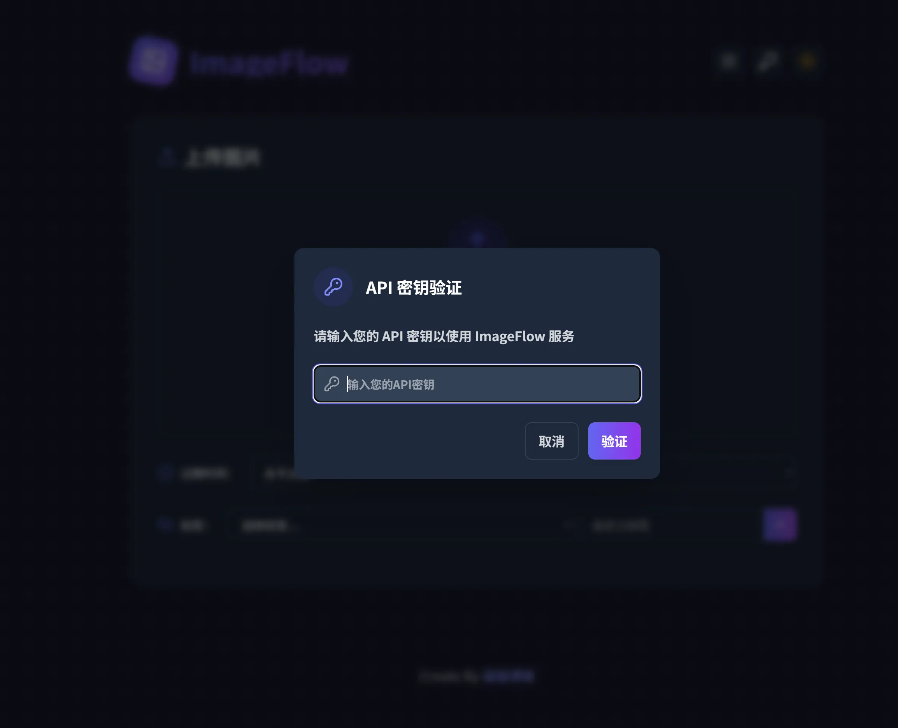
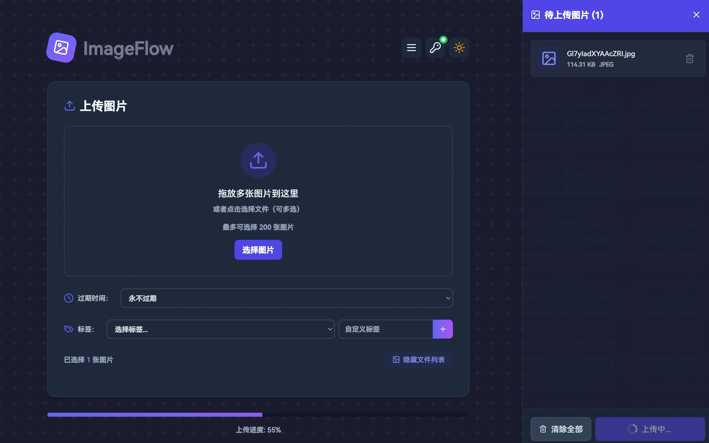
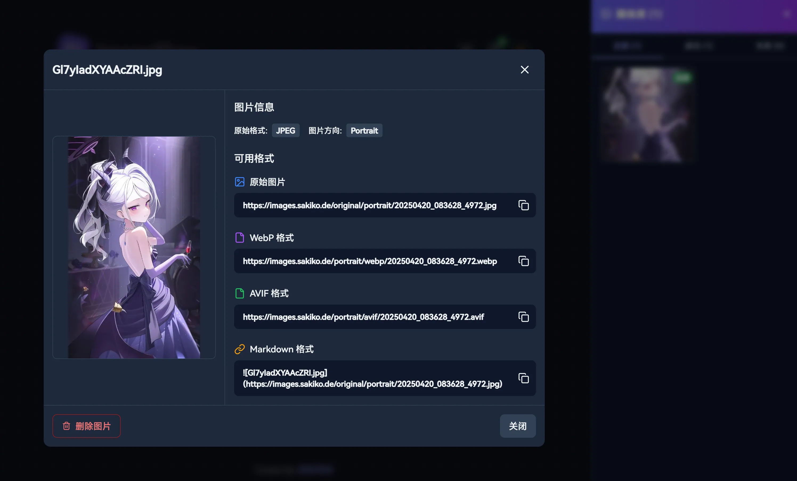
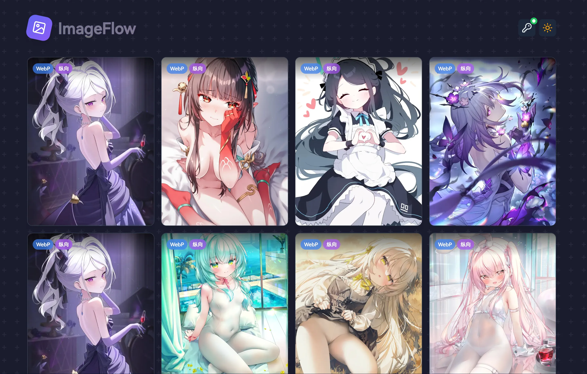
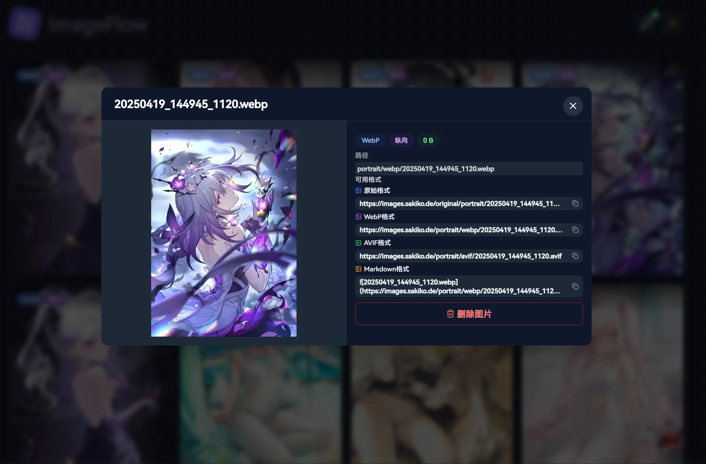
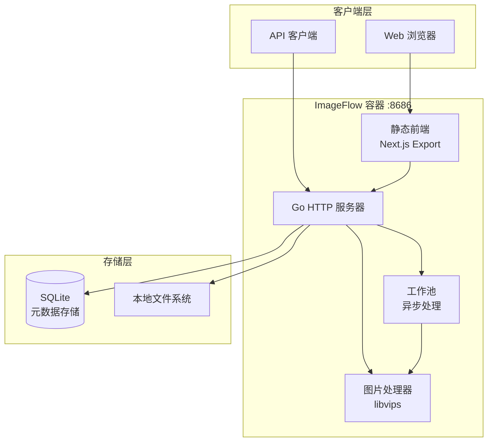

<div align="center">

# ImageFlow


[](https://hub.docker.com/r/soyorins/imageflow)
[](LICENSE)
[](https://go.dev/)
[](https://nextjs.org/)

**现代化图片管理与分发平台，支持自动格式优化**

</div>

---

> 本项目基于 [Yuri-NagaSaki/ImageFlow](https://github.com/Yuri-NagaSaki/ImageFlow) 修改。

## 简介

ImageFlow 是一个全栈图片管理平台，能够自动为不同设备和浏览器优化图片。它结合了高性能的 Go 后端和现代化的 Next.js 前端，提供智能图片转换、设备感知服务和强大的过滤功能。

## 预览

<div align="center">





</div>

## 系统架构



### 组件概览

| 组件 | 技术栈 | 描述 |
|------|--------|------|
| 前端 | Next.js 14, TypeScript, Tailwind CSS | 现代化 Web 界面，支持拖拽上传 |
| 后端 | Go 1.23+, libvips | 高性能图片处理服务器 |
| 元数据 | SQLite | 单文件元数据存储，项目目录持久化 |
| 存储 | Local | 本地文件系统图片存储 |

## 功能特性

### 图片处理

- 自动转换为 WebP 和 AVIF 格式
- 基于 libvips 的高性能处理
- 可配置的质量和压缩设置
- 后台工作池异步处理
- GIF 保持原格式（保留动画）

### 智能分发

- 设备感知方向检测（移动端竖屏，桌面端横屏）
- 基于浏览器的格式协商（AVIF > WebP > 原格式）
- 多标签过滤，支持 AND 逻辑
- 敏感内容排除过滤
- 强制方向覆盖选项

### 存储选项

- 本地文件系统存储
- 按方向和格式组织的目录结构

### 安全特性

- 管理端点 API Key 认证
- 过期图片自动清理
- 可配置的 CORS 策略
- 公共 API 自动排除敏感内容

### 现代化前端

- Next.js 14 App Router
- 拖拽批量上传
- 深色模式支持
- 响应式瀑布流布局
- 实时上传进度

## 部署指南

### 环境要求

- 已安装 Docker 和 Docker Compose
- 建议最低 1GB 内存
- 足够的磁盘空间用于图片存储

### 快速开始

```bash
# 克隆仓库
git clone https://github.com/fupcode/ImageFlow.git
cd ImageFlow

# 创建配置文件
cp .env.example .env

# 编辑配置（参见下方配置说明）
nano .env

# 启动所有服务（使用预构建镜像）
docker-compose up -d

# 或本地构建用于开发/测试
docker-compose -f docker-compose.build.yaml up --build -d
```

部署完成后：
- 前端界面与后端 API：`http://localhost:8686`

### 服务架构

默认部署包含一个容器，并将 SQLite 元数据持久化到项目目录：

| 服务 | 端口 | 描述 |
|------|------|------|
| imageflow | 8686 | Go API 服务器，并托管静态前端 |

| 本地路径 | 容器路径 | 描述 |
|----------|----------|------|
| `./data` | `/app/data` | SQLite 元数据数据库目录 |

## 配置说明

在项目根目录创建 `.env` 文件，包含以下设置：

### 核心配置

| 变量 | 必需 | 默认值 | 描述 |
|------|------|--------|------|
| `API_KEY` | 是 | - | 上传/管理 API 的认证密钥 |
| `LOCAL_STORAGE_PATH` | 否 | `static/images` | 本地图片存储路径 |
| `CUSTOM_DOMAIN` | 否 | - | 图片资源自定义域名；建议填写完整协议，如 `https://img.example.com` |
| `DEBUG_MODE` | 否 | `false` | 启用调试日志 |

### 元数据配置

| 变量 | 必需 | 默认值 | 描述 |
|------|------|--------|------|
| `METADATA_SQLITE_PATH` | 否 | `/app/data/metadata.db` | SQLite 元数据数据库路径；Docker 默认映射到项目目录 `./data/metadata.db` |

### 图片处理配置

| 变量 | 必需 | 默认值 | 描述 |
|------|------|--------|------|
| `MAX_UPLOAD_COUNT` | 否 | `20` | 单次上传最大图片数 |
| `IMAGE_QUALITY` | 否 | `75` | 转换质量（1-100） |
| `WORKER_THREADS` | 否 | `2` | libvips 并行处理线程数 |
| `WORKER_POOL_SIZE` | 否 | `1` | 并发图片处理工作数 |
| `SPEED` | 否 | `4` | 编码速度（0=最慢/最佳，8=最快） |

### 前端配置

| 变量 | 必需 | 默认值 | 描述 |
|------|------|--------|------|
| `NEXT_PUBLIC_API_URL` | 否 | - | 前端构建时使用的 API URL；默认同源请求，Docker 内置前端通常留空。修改后需要重新构建前端/镜像 |

### 配置示例

```bash
# 核心配置
API_KEY=your-secure-api-key-here
DEBUG_MODE=false
LOCAL_STORAGE_PATH=/app/static/images

# 元数据配置
METADATA_SQLITE_PATH=/app/data/metadata.db

# 图片处理
IMAGE_QUALITY=75
WORKER_THREADS=2
WORKER_POOL_SIZE=1
MAX_UPLOAD_COUNT=20

# 前端配置
NEXT_PUBLIC_API_URL=
# 图片访问域名
# CUSTOM_DOMAIN=https://img.example.com
```

## API 简介

默认 API 地址：`http://localhost:8686`

| 方法 | 接口 | 说明 | 认证 |
|------|------|------|------|
| `GET` | `/api/random` | 获取随机图片，支持标签、方向和格式过滤 | 否 |
| `GET` | `/api/config` | 获取前端运行配置 | 否 |
| `POST` | `/api/upload` | 上传图片并生成优化格式 | 是 |
| `GET` | `/api/images` | 分页列出图片 | 是 |
| `POST` | `/api/delete-image` | 删除指定图片 | 是 |
| `POST` | `/api/update-tags` | 更新图片标签 | 是 |
| `GET` | `/api/tags` | 获取所有标签 | 是 |

管理接口使用 `Authorization: Bearer your-api-key` 认证。

完整请求参数、响应结构和示例请查看 [API 详细文档](docs/api.md)。

## 项目结构

```
ImageFlow/
├── main.go                 # 应用入口
├── config/                 # 配置管理
├── handlers/               # HTTP 请求处理器
│   ├── auth.go            # 认证中间件
│   ├── upload.go          # 图片上传处理器
│   ├── random.go          # 随机图片 API
│   ├── list.go            # 图片列表
│   ├── delete.go          # 图片删除
│   └── tags.go            # 标签管理
├── utils/                  # 核心工具
│   ├── converter_bimg.go  # libvips 图片处理
│   ├── storage.go         # 存储接口
│   ├── sqlite.go          # SQLite 元数据存储
│   ├── worker_pool.go     # 异步处理
│   └── cleaner.go         # 过期图片清理
├── frontend/              # Next.js 应用
│   ├── app/               # App Router 页面
│   ├── components/        # React 组件
│   └── utils/             # 前端工具
├── docker-compose.yaml       # Docker 部署（预构建镜像）
├── docker-compose.build.yaml # Docker 部署（本地构建）
├── Dockerfile.backend        # 全栈一体化容器
└── .env.example           # 配置模板
```

## 图片存储结构

```
static/images/
├── original/
│   ├── landscape/         # 原始横屏图片
│   └── portrait/          # 原始竖屏图片
├── landscape/
│   ├── webp/              # WebP 格式横屏
│   ├── avif/              # AVIF 格式横屏
│   └── thumb/             # 640px WebP 横屏缩略图
├── portrait/
│   ├── webp/              # WebP 格式竖屏
│   ├── avif/              # AVIF 格式竖屏
│   └── thumb/             # 640px WebP 竖屏缩略图
└── gif/                   # GIF 文件（保持原格式）
```

## 许可证

本项目基于 MIT 许可证开源。详见 [LICENSE](LICENSE) 文件。

## 致谢

- [libvips](https://github.com/libvips/libvips) - 高性能图片处理库
- [bimg](https://github.com/h2non/bimg) - libvips 的 Go 绑定
- [Next.js](https://nextjs.org/) - 生产级 React 框架
- [Tailwind CSS](https://tailwindcss.com/) - 实用优先的 CSS 框架
- [SQLite](https://www.sqlite.org/) - 轻量级元数据存储
